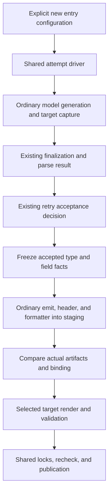

# Responsibilities, ownership, and lifecycle

This document defines design choices and acceptance conditions, not an existing product implementation. Baselines: dcg `4f96e22ea403a66faae96f3949d41dd61fc1186f` and legacy fastapi-code-generator `b3b9bd66e0b0c4d8c686fda700258104615a1332`. Historical observations retain their original source commits; see [REFERENCES](REFERENCES.md#evidence-status).

## 1. Selected design and rejected alternatives

Existing DataModel/DataType/Reference objects remain the mutable working graph for Python model generation. Only a new target correlates actual type generation, replacement, and field copies with OpenAPI semantics, then freezes the accepted attempt into immutable contracts. Do not replace the existing graph with a common IR or expose a live parser to FastAPI/client targets.

| Alternative | Decision | Reason |
| --- | --- | --- |
| Move the legacy FastAPI generator into the same repository | Rejected as the integration solution | It already uses dcg for models. Live-graph dependencies, additional parsing, and type-string repair would remain. |
| Reparse the source specification separately and map source pointers to names | Rejected | This cannot accurately represent reuse/collapse/variants, field aliases, non-class types, or rejected attempts, and would require maintaining two OpenAPI interpretations. |
| Copy the entire graph, observe every mutation, or introduce a universal compiler IR | Rejected | This broadly changes model-path cost, ownership, and ordering and exceeds the demonstrated boundary requirements. |
| Target-specific factories, recording necessary actual mutation relationships, and field/type contracts | Selected | Preserves model-processing order while sharing final types and wire semantics. Integration points and acceptance can be bounded. |
| Construct new DataTypes, reserve names, or reevaluate type hints for capture | Prohibited | Observation itself can affect Reference.children, caches, and imports. |

The new generators initially belong to the same distribution as dcg. The old FastAPI generator retains its independent implementation and eventual deprecation guidance. dcg core/model/parser layers do not depend on FastAPI/client/HTTP runtimes. See [ENTRY](DECISIONS-ENTRY.md).

## 2. Layer and cost boundaries

| Owner | Responsibility | Excluded responsibilities |
| --- | --- | --- |
| Existing dcg model generation | Input/ref handling, registration/naming, graph mutations, sorting/modules/imports/forward references, rendering/formatting, ordinary publication | Target-driven changes to settings, types, or ordering |
| Model generation for explicit `api` scope | Walk all API schema uses with declaration identity. Ordinary dcg and targets use the same Api owner, with semantics distinct from legacy scopes. | Changing legacy scopes, automatically adding scope for a target, or introducing a separate model backend |
| Optional parser/store integration points | Record actual generation/copy/replacement/moves within the same attempt and finalize type/field facts | Target-name switches, HTTP runtimes, or external repair of private graph state |
| Shared generation management | Source leases, accepted attempts, type contracts, staging, selected-target ownership manifests, publication | A second implementation of the existing retry driver or unapproved changes to existing metadata formats |
| OpenAPI semantics and final binding | Ordered operations, wire facts, source/use identity, Python types/fields/imports/modules | Discarding facts for FastAPI primary-response selection or client retry policy |
| Shared model/wire codecs | All five client backends, including the two Pydantic v2 backends shared with the server; schema validation, aliases, omission/null/default/direction, native/envelope handling, parameters/media | SDK-specific model fields/bases, reparsing type strings, weaker-type fallback on validation failure, or unconditionally repeating standard FastAPI validation |
| FastAPI target | Two Pydantic v2 backends; generation-time projection onto Annotated/Depends/Security/response_model; adapters only where needed; routes/service Protocols/routers, Form/File, served docs, templates/hooks, selective regeneration | Server support for the other three backends; client token acquisition/retries/pools; custom DI containers or universal custom multipart parsing/cancellation tasks |
| Client target | Resources/methods/signatures, request/response plans, configuration, documentation/packages, required runtime dependencies | Launching the legacy generator or independently generating models |
| Client runtime | Call/attempt budgets, transport, authentication, retries, response/stream ownership, protocol helpers | Generation-time parsers/model graphs or global state for unused capabilities |

Generator source and tests may be shared, but generated server/client packages each contain an independent private runtime. They do not depend on each other at runtime and may reference the same model package. Each run selects one target. New entry points enforce server-two/client-five backend coverage without adding server restrictions to ordinary dcg or the common graph. Standard dataclass, TypedDict, and msgspec converters and tests are additional client responsibilities. Another transport adds I/O and conformance tests; another model backend adds codec/type-projection conformance. Do not force another protocol into OpenAPI parameter semantics.

The FastAPI target alone selects its integration strategy. Do not write FastAPI type tests or primary-response preferences back into shared facts/binding. Determine standard-API representability per parameter/body/response, rather than splitting every operation between two execution backends. Parsing/coercion/filtering at standard integration points follows FastAPI; adapter wire behavior follows MODEL-CODECS. Do not claim equivalence for every input. Reusing common assets does not require the server and client to share HTTP execution machinery.

## 3. Required shared facts

These are facts demanded by F01–13/C01–33, not speculative fields reserved for later client design. They feed the [BINDING](DECISIONS-BINDING.md) contracts and [MODEL-CODECS](DECISIONS-MODEL-CODECS.md).

| Shared fact | Server use | Client use and acceptance |
| --- | --- | --- |
| Source document/base URI, pointer, declaration order, effective operation identity | Router/operation diagnostics and stable handler wiring | C09/C28/C32 metadata references/naming; G10 |
| Declared/inherited values, omission versus explicit emptiness, parameter location/name/override | Path/query/header/cookie/querystring and inherited auth | C10/C17 empty security, duplicate query values, location collisions; MC10 |
| Schema dialect/ref registry, required/default presence, nullable, readOnly/writeOnly, style/explode/content/encoding | Input validation, typed handlers, uploads/forms | C10–13/C27 body/presence/serialization; MC02–10 |
| All exact/range/default statuses, media, response headers, and absent bodies | Response declarations, HTTPResult, served specifications | C14–16/C19–25 errors/raw/streams/pages/polling; X06–10 |
| Source property occurrence to final field slot, wire/Python names, aliases, constructor/default/constraints, merge/inheritance/exclusion | Construction and native/envelope decisions for the two server backends | C11/C27 across five backends; custom mapping and distinct wire uses after reuse; G09/MC03–09 |
| Final primitive/container/union/enum/alias/model structure, module/export/import identity, keep_unaliased | Real handler annotations/imports | C11/C28/C30 method/response/codec references; B/MC01/MC07 |
| Security/server/callback/link semantics, source, and original ordered references | Authorization integration, docs, callback classification | C09/C17–23; no token, secret, or replay decisions in these facts |
| Accepted AttemptId, SourceLease, artifact address/hash | Models and routes belong to the same generation result | All C requirements; exclude rejected retry results; G02/G04/G11 |
| New target metadata version, referenced locations, type consistency | Extension diagnostics | C06/C18–25/C33; do not infer idempotency, pagination, or resumption metadata from OpenAPI |

**G10 is required before FastAPI publication.** A client dry consumer must obtain these facts without a live graph, a separate specification parse, or guessed names, checked against a handwritten expected factsheet. A common representation that discards statuses/media/headers fails even if FastAPI selects one response. Verify this boundary before the client runtime is complete. See [ACCEPTANCE](ACCEPTANCE.md).

## 4. Generation phases and attempt lifetime

BINDING's source table is authoritative for current schema/path traversal, name/reference registration, dependency sorting, reuse/collapse, module moves, imports/forward references, rendering, and formatting. Preserve their order when the additional scope is not selected. Only explicit `api` scope selects the lazily imported `ApiOpenAPIParser(OpenAPIParser)`. That subclass maintains declaration frames and calls existing schema/ref type generation; it does not parse a use twice through legacy Paths/Parameters paths. Preserve the body and signature of `_process_path_items` and its late `self.parse_operation` lookup. Do not add observer branches to the old operation loop, duplicate that loop solely for capture, or temporarily replace methods.

The new declaration-aware operation traversal belongs to the Api scope owner and reuses existing loader/ref/model leaves. Do not replace old-scope traversal to supplement facts or add a new Python helper call to every old reference operation. Maintaining consistency of override/order/security rules between remaining legacy traversal and the new Api scope is a permanent cost with explicit oracles.

Capture subclasses must not make extra calls to getters with side effects. Do not add DataType/Reference fields or always create an observer in default GenerationStore. Avoid overriding methods whose identity existing fast paths inspect. Obtain actual constructor defaults and msgspec Meta values through a bounded field index over the accepted Result and final artifact verification, not by reevaluating default/type_hint/render getters for observation. Call each actual copy helper once with its original arguments, then record the returned correspondence on the target side.

Do not freeze types inside a parse override. A binding failure inside the exception-catching scope of existing stdout repair could be mistaken for parse failure and change the accepted attempt. Apply existing driver retry acceptance first and return only the accepted candidate's value contract. Preserve `_ParsedGeneration`; the new path uses `ModelGenerationProduct`.

`GeneratedTypeContractBatch` owns accepted AttemptId and operation/type-use/final-symbol/artifact-address/field values. The Product, not the batch, owns `SourceLease`. Release it when required document projections have been frozen. Do not expose live DataModel/DataType/Reference objects or post-disposal source references. Verify artifacts already staged by existing render/formatter processing once; do not render again for binding validation.

## 5. Non-interference and outstanding implementation evidence

The source identifies concrete hazards: DataType construction changes Reference.children; type_hint can affect optional/import state; reuse/collapse merges or deletes references; disposal releases Reference.source and related objects. Existing metadata lacks complete operation-use and field lineage, and retrieving it can itself add work. See the [BINDING source table](DECISIONS-BINDING.md) and [verification status](REFERENCES.md#evidence-status).

The selected ownership boundaries address those hazards but do not prove the performance of unimplemented code. Store/resolver factory organization, non-function copy-holder dispatch, a single dotted-postprocess getter, shared-driver cold helpers/frames, and new enum values/CLI choices can still have costs. Inspect source to verify that existing paths acquire no target imports, state, or whole-input scans; compare A/A and A/B with existing benchmarks. An off switch or small average difference does not prove non-interference. Reject reproducible regressions. See [ACCEPTANCE](ACCEPTANCE.md).

Register new APIs/scopes as additions in the appropriate baselines. Do not delete or change existing signatures/exports/members to erase differences. Separate additive help choices from execution/output differences for existing inputs. Authorization for optional features does not authorize changes to existing model semantics.

## 6. Diagnostics and publication

Common result categories are fixed: **E** rejects the entire selected target with no public output changes; **S** records an explicitly requested operation exclusion and its reason in manifests/docs; **W** is information that does not change wire, type, or generation contracts. Do not approximate unsupported semantics or emit success-looking stubs. Generated service Protocols declare the business methods users implement; they are not stubs standing in for unsupported generator behavior.

Pass specification strings through one Python literal encoder. Escape identifiers, docstrings, README/HTML, and other output contexts according to their own rules. Never inject raw template values directly into code. Expected values must not reuse the implementation's encoder; provide independent AST/value negative oracles.

Stage models, target artifacts, metadata, remote locks, and ownership manifests, then publish only after every validation succeeds. Rewrite owned files on every run, edited or not, as model generation does, but do not overwrite unmanaged files, treat a disappeared manifest as first-time generation, or automatically adopt a legacy tree. There is no cross-target registry, combined generation, or retirement API. Compare the selected target's manifest and model inventory. Generate shared models normally and verify each target independently; another target need not exist or be updated. Detect model mismatches on each target's next check/verify run. Different model-output roots updating the same remote lockfile participate in the same resource lock. For catchable failures, roll the journal back in reverse order. Unrecoverable restoration raises a dedicated exception preserving the original cause and backups. Do not promise instantaneous reader-visible atomicity across files/filesystems or automatic recovery after SIGKILL. See [ENTRY](DECISIONS-ENTRY.md).

## 7. Runtime ownership after generation

| State | Owner and lifetime |
| --- | --- |
| HTTP client/pool | SDK-created instances are owned; injected instances are borrowed by default. Client close and response close are separate. |
| Response | Before handoff, the SDK disposes it on retry, decoding failure, and cancellation. After successful stream-handle handoff, the caller uses its context manager or close method. Do not rely on GC or loop break alone. |
| Call/attempt | The call owns effective configuration, key, deadline, and send budget; an attempt owns one body/response. Sync/async share policy but have separate I/O lifecycles. |
| OAuth refresh | An independent provider-owned RefreshSession. One caller's cancellation/short deadline does not break other waiters. Do not automatically resend a rotation request with an unknown delivery outcome. |
| Paging/polling/stream/WS | Explicit session limits/resumption rules and parent budgets. Generic retries must not repeat initial creation requests or already delivered events. |
| Presence/envelope | Wire snapshots retain omission/null/default distinctions. Model mutations do not silently update snapshots. |

Only RUNTIME/PROTOCOLS/MODEL-CODECS define detailed values and transitions. The shared parser does not own runtime state.

## 8. Generated types and user-owned code

[TYPING](DECISIONS-TYPING.md) defines common typing rules for targets and runtimes. Sharing generation facts does not imply combined server/client generation, which is excluded. Preserve type correlations for HTTP responses, media-specific bodies, codecs, callbacks, handlers, and protocol helpers from public interfaces through internal dispatch. Do not strengthen existing model types by changing their output or settings.

Business logic lives in users' own modules outside the target, implementing the generated service Protocols. Every target file, including routes, HTTP adapters, and the service Protocols, is generator-owned and regenerated. Users edit their modules, not regenerated files. A regenerated Protocol that type checkers or startup checks report against an implementation does not mean the generator has updated the user's business logic.
