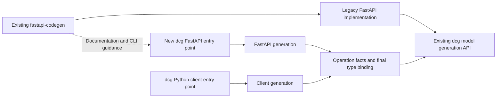

# FastAPI and Python client generation plan

This is the design for new optional generation features. Product implementation, migration, and release have not started. This directory is the authoritative public plan. The implementation baseline is dcg `4f96e22ea403a66faae96f3949d41dd61fc1186f`; the legacy FastAPI baseline is `b3b9bd66e0b0c4d8c686fda700258104615a1332`.

**The new FastAPI target supports Pydantic v2 BaseModel and Pydantic v2 dataclass. The client supports all five current dcg model backends.** Existing dcg model generation retains its full backend coverage.

## 1. Selected structure

**The existing fastapi-code-generator retains its current repository and implementation and continues normal maintenance against current dcg APIs. Its documentation and CLI help will direct users to dcg once the replacement is available. dcg owns and directly exposes the new FastAPI and Python client generators.**

The dotted edge is user guidance, not a program invocation. Do not add a legacy/new backend selector to the old FastAPI CLI. Do not introduce a mechanism that launches dcg in another environment, executable discovery, dual-environment installation, bridge processes, or compatibility adapters for that arrangement. There is no reverse dcg-to-fastapi-code-generator dependency, import, template lookup, or invocation. Do not create a `fastapi-code-generator-next` package or CLI.

The existing `datamodel-codegen` CLI selects the new features through explicit options. The Python entry points are `datamodel_code_generator.fastapi.generate_fastapi()` and `datamodel_code_generator.client.generate_client()`. No additional console command is planned. These names describe unimplemented contracts; do not advertise them as available migration destinations before release. Optional new APIs/options and internal integration points are permitted, while existing output, APIs, behavior, dependencies, and performance remain protected. Do not wrap existing entry points in target-specific preprocessing.

A run selects either `--generate-server fastapi` or `--generate-client httpx`. They are mutually exclusive. There is no combined-generation CLI, public API, or targets array. `--output` retains its existing model-output meaning; `--target-output` identifies the selected target output, and an explicit `--target-config` supplies detailed target configuration. Existing dcg CLI/configuration/Python API mechanisms continue to own model settings. Parsing, final type binding, and publication are shared internally, but server development and SDK generation remain separate executions. New entry points accept one root OpenAPI document and resolve external references normally. Existing dcg directory and multiple-file input behavior is unchanged. [ENTRY](DECISIONS-ENTRY.md) fixes configuration, signatures, output ownership, and dependencies.

Legacy deprecation guidance belongs in the README, documentation, and existing CLI help, explaining the migration reason, replacement feature coverage, and output differences. It does not require an unconditional notification on normal generation stdout, changed exit codes, or Python imports. Publish accurate guidance when the replacement becomes available. No legacy removal date is set here. Do not permanently pin the legacy tool to dcg 0.65. Normal API maintenance and its tests remain the legacy project's responsibility; the new foundation is not conditional on byte identity with every legacy output generated using dcg 0.65.

## 2. Compatibility and permitted improvements

| Surface | Requirement |
| --- | --- |
| Existing dcg model generation | Preserve generation order, the entire file tree and bytes, public and de facto APIs, side effects, dependency constraints, and performance for existing inputs, settings, and environments. |
| dcg model artifacts with a new target selected | Match all bytes from ordinary generation using the same dcg version, explicit model settings, and conditions. A target must not change names, model structure, sorting, imports, or settings. |
| New FastAPI server code | Legacy implementation, file layout, and output bytes need not match. Carry forward the useful existing capabilities and validate the improved design against new independent expectations. |
| Legacy fastapi-code-generator | Retain its implementation and usage paths in its existing location. Do not own a second backend or environment launcher for the new dcg target. Evaluate and explain normal dependency/API maintenance in that project. |
| New client | Define its new public behavior explicitly. Do not replace dcg models with client-specific models or silently alter validation settings. |

The legacy tool's production use is a premise supplied by the maintainer. Its synchronous applications/endpoints, routers/tags, selective regeneration, upload/form/raw bodies, custom templates/visitors, and model options inform the new server requirements. A capability remaining in the legacy tool is not evidence that the replacement implements it. See the [FastAPI capability inventory](FASTAPI-REQUIREMENTS.md).

The new server separates generated routes from handwritten handlers and preserves those handlers during regeneration. **Generated code follows standard patterns in the official FastAPI documentation.** Use `Annotated` with Path/Query/Header/Body, Depends/Security, Form/File/UploadFile, and suitable `response_model` types. Explicit adapters handle only the remaining type/wire differences for the two Pydantic v2 backends. Cookie-form percent conversion uses the codec shared with the client so the same value does not acquire a different string interpretation. Select parameter/body/response integration strategies at generation time; do not fall back to another strategy after runtime failure. Do not extend server coverage to the client's other three backends or force low-level Request/Response handling on every route.

Handlers use existing model types, default to synchronous functions, and also support explicit async configuration. Do not generate adjacent `.pyi` files that hide handwritten implementations from checking. Detect changes using independent signature Protocols and checks of the actual `.py` files. Standard FastAPI parsing, coercion, validation errors, and response filtering are a different contract from strict wire validation in shared codecs. Do not describe these strategies as universally equivalent performance optimizations. Adapters handle direction differences and missing type information that cannot be represented without changing models. [FASTAPI](DECISIONS-FASTAPI.md) fixes router selection, updates, templates/hooks, authentication, forms/uploads, and their conditions. Inheriting useful capabilities does not require recreating private legacy parser objects or type-string replacement.

Use standard FastAPI multipart parsing and dependency injection. Do not generate a custom multipart reader, route/task ownership system, or dedicated form getter. Preserve standard dependency error behavior and API documentation contributed by user dependencies. Do not claim complete cleanup under arbitrary cancellation conditions beyond FastAPI's guarantees.

## 3. Design server and client boundaries together

Implement useful FastAPI coverage first, but **use production client requirements when defining the shared boundaries**. Do not merely assume retries, pagination, streaming, and authentication can be fitted later.

Shared facts include original operations, parameter wire information, request bodies, every response status/media/header, security, servers, source locations and use context, final Python type binding, and the identity/lifetime of the accepted generation attempt. FastAPI primary-response selection and client retry policy do not belong in the shared parser. Pagination, idempotency, polling, and stream-resumption behavior not described by OpenAPI require explicit supplementary configuration and diagnostics. See [ARCHITECTURE](ARCHITECTURE.md).

Model validation and HTTP serialization remain different responsibilities. [MODEL-CODECS](DECISIONS-MODEL-CODECS.md) fixes omission/null, aliases, readOnly/writeOnly, defaults, and unknown-enum rules for client and server adapters. Model-external snapshots retain omission information that ordinary dataclasses and other backends cannot retain. When valid directional wire data cannot construct an unchanged model with required fields, use an envelope type declared at generation time. Native validation failure must not fall back to a weaker type. Distinguish a dcg-supplied `None` default on an optional field from an explicit input null; specify what plain models cannot reveal and provide the outbound factories required by the contract. Do not apply the same codec twice at a standard FastAPI boundary or weaken client wire rules to match server coercion.

The mutable graph remains the model-generation working graph. [BINDING](DECISIONS-BINDING.md) fixes target-specific store factories, capture of actual copy/replacement relationships, field-level binding, and accepted-attempt freeze/disposal. Do not add observer fields or a full mutation history to the default graph. This is a design decision, not proof that the unimplemented change passes all configurations and performance checks.

Add an explicitly selected `api` value to the existing `--openapi-scopes` option for otherwise missing types. Its scope, order, and naming cover headers/cookies, response headers, callbacks, and the other uses specified in BINDING. Preserve existing scope meanings and defaults. A target never adds the scope automatically. Compare model bytes between ordinary generation with `api` and server/client generation with the same settings. This is an explicit model-output scope extension, not hidden target-specific model generation.

## 4. Initial production client scope

[CLIENT-REQUIREMENTS](CLIENT-REQUIREMENTS.md) is the feature and acceptance register. Each row maps requirements to owners, configuration semantics, failures, and independent tests. [COVERAGE](COVERAGE.md) connects C01–C33 to authoritative dcg contracts, independent acceptance cases, and maintenance responsibilities.

Common requirements include sync/async, per-request settings, timeouts, total deadlines, cancellation, safe retries, HTTP client injection and ownership, connection pools/TLS/proxies, request/response codecs, typed exceptions, raw responses, authentication, upload/download, observation hooks, extension/regeneration/package support, documentation, and tests. Implement idempotency, pagination, polling, SSE/NDJSON, and similar conditional capabilities initially, enabling them only for APIs that provide the required explicit contracts.

[PROTOCOLS](DECISIONS-PROTOCOLS.md) and [RUNTIME](DECISIONS-RUNTIME.md) also fix applicability, metadata, limits, ownership, and failures for OAuth refresh, WebSockets, webhook signatures, caching, resumable uploads, batches, explicit offline queues, circuit breakers, and compression. Do not include their runtimes indiscriminately in APIs that do not need them. Hosted documentation services, enterprise SSO, billing, and automated registry publishing operations are outside the initial scope. [CLIENT](DECISIONS-CLIENT.md) is authoritative for names, public methods, all statuses/media, configuration, and generated packages.

Retries require more than a maximum count. Define operation replay safety, body replayability, waits, Retry-After, total deadlines, authentication refresh, stream progress, and connection disposal together. Status codes alone do not establish that replaying an operation is safe; apply the explicit API idempotency and body-replay contracts.

The first HTTP runtime is HTTPX2 with native sync/asyncio support. Diagnose Trio and other initially unsupported capabilities before sending. **The client supports Pydantic v2 BaseModel, Pydantic v2 dataclass, standard dataclass, TypedDict, and msgspec.Struct; the new server supports only the first two.** Keep five-backend codec support for clients without adding non-Pydantic server paths. Select server and client backends independently. Do not silently convert unsupported settings or generate a second model for the server. API similarity to the original HTTPX does not establish compatibility of injected Client/Response/exception objects. Runtime selection is explicit; import failures do not trigger automatic fallback. Define transport substitution contracts, but implement only HTTPX2 as the initial built-in HTTP transport.

## 5. Maintenance and value

The legacy FastAPI generator already uses dcg for models. Potential reductions concern its extra parsing, recovery of type information, adaptation to private graph changes, and duplicated server/client operation interpretation. Omitting the legacy selector/environment bridge avoids owning that feature's implementation, operating-system tests, dependency discovery, and diagnostics.

Normal legacy maintenance, migration documentation, and replacement coverage tests remain necessary. Do not create a transparent layer emulating every private operation available to old visitors; map useful extension capabilities to dcg-owned contexts. Distinguish temporary dual maintenance from permanent duplication within the new foundation. Combined generation, cross-target registries, and retirement mechanisms are excluded. Each run checks the selected target's ownership manifest and model expectations. Generate shared models with ordinary dcg, then update each target independently in verify mode. Do not discover, update, or continuously monitor other targets; detect each target's model mismatch during its next check/verify run.

Do not charge shared semantic facts, type binding, model/wire codecs, generation lifecycle, and ownership/publication a second time to the client increment. Client-specific request construction, response handling, retry/auth/paging/stream policy, transports, exceptions, runtime distribution, and vulnerability maintenance are additional responsibilities. Concrete benefits include preserving models used by existing Python code, regeneration after specification changes, and consistent server/client settings.

Use LLM assistance for implementation, fixtures, documentation, and change investigation. Independent oracles remain necessary so implementation and expected results do not repeat the same misunderstanding. [RATIONALE](RATIONALE.md) separates shared infrastructure, server responsibilities, client increments, and the bounded later-input roadmap.

Do not declare the replacement complete while required features or compatibility and performance checks remain incomplete.

## 6. Authoritative contracts and implementation acceptance

The eight `DECISIONS-*` documents fix entry points, scope, binding, five-backend codecs, FastAPI, client, runtime, and protocol contracts. Implementers are not expected to invent missing APIs or defaults. [IMPLEMENTER](IMPLEMENTER.md) explains authority and reading order. [ACCEPTANCE](ACCEPTANCE.md) connects specifications, configuration, generated/runtime behavior, and independent oracles. Diagnosing a required but unimplemented feature as unsupported does not count as implementing it.

Non-interference across all existing dcg settings, complete reuse/collapse/RequestResponse/multiple-module binding, and runtime implementation, generation, communication, and performance remain unverified. Source research reduces known omissions but cannot prove that no future API will expose a counterexample.

Earlier source references use dcg `3452dfbb428c4384f40cb16faf61aadfda58a3a8`; the implementation baseline is `4f96e22ea403a66faae96f3949d41dd61fc1186f`. Retain each source link's actual commit. Run baseline and candidate comparisons for each implementation change under the conditions in [ACCEPTANCE](ACCEPTANCE.md). See [REFERENCES](REFERENCES.md#evidence-status) for verification status.

## 7. Generated typing and server updates

Use the concrete types, Generic, Literal/overload, Protocol, and necessary TypedDict/Unpack contracts in [TYPING](DECISIONS-TYPING.md) throughout new public APIs, private runtimes, and extension points. Do not erase correlations through Any/object, casts, or ignores. Document genuinely dynamic external boundaries and types inherited from existing dcg output. Stronger target typing must not rewrite existing models.

After initial scaffolding, business handlers are user-owned. Keep them separate from regenerated routes, HTTP handling, and handler Protocols. Do not overwrite or automatically merge handwritten business code. New operations receive new stubs; deleted operations leave handwritten files intact with a diagnostic. Signature changes are checked against updated Protocols and user HTTP/business tests. When authentication uses a concrete user Principal type, pass typed `Handlers[Principal]` and the corresponding authorization function to the same builder for checking. Do not infer user types from implicit scaffold wiring or present startup argument-shape checks as proof of all types. Unimplemented business stubs return 501; they are not success stubs hiding missing generator capabilities. See the [regeneration contract](DECISIONS-FASTAPI.md).
