# Functional PR stacks

All implementation stacks are **not started** at publication. The planning-document PR is not an implementation stack. Begin with one assigned stack, initially S01. PR counts represent review boundaries, not effort or delivery predictions.

Register multiple implementation PRs using GitHub native stacks (`gh stack`). Complete implementation, verification, and independent review for a stack; start the next stack from main after its prerequisites have merged. Leave the handoff record below when work stops.

## 1. Boundaries and dependencies

Use three PRs per stack by default, or four for complex responsibilities. These are concrete review divisions, not units of effort. If actual diffs require a revised split, preserve contracts, acceptance, and completion state, and continue using native stacks for multiple PRs.

**Merge prerequisite stacks into main before starting dependent stacks from current main.** Do not place the entire effort in one chain or create hidden dependencies by stacking an otherwise separate feature on an unmerged stack. Work on one implementation stack at a time.

```mermaid
flowchart LR
  S01[Integration points] --> S02[API scope] --> S03[Final binding]
  S03 --> S04[Shared codecs and Pydantic v2]
  S03 --> S05[Artifact ownership and publication]
  S04 --> S06[FastAPI basic generation]
  S05 --> S06
  S06 --> S07[FastAPI completion and publication]
  S07 -. Separate repository .-> F01[Legacy migration guidance]
  S07 --> S08[Remaining three backend codecs]
  S08 --> S09[Client HTTP foundation]
  S09 --> S10[Retry, auth, and budgets]
  S10 --> S11[Streams, paging, and polling]
  S11 --> S12[WS, webhooks, and cache]
  S12 --> S13[Additional operational protocols]
  S13 --> S14[Client completion and publication]
```



S04 and S05 must not depend on each other's unmerged code. Cross-layer APIs beyond their diagrammed prerequisites use existing ENTRY/BINDING contracts. Execute S04 before S05. Client implementation follows FastAPI publication, but S03 must already execute a dry consumer checking client information requirements.

| Stack | PRs, bottom to top | Completion gate and authoritative contracts |
| --- | --- | --- |
| S01 Integration points (3) | 1. Comparison/observation baseline → 2. Bounded store/resolver/copy integration points → 3. Shared driver and attempt/disposal integration | Section 2 below. Existing behavior/performance, G05–07, B09/B12/B14/B19. Not completion of all capture capabilities. |
| S02 API scope (3) | 1. Declaration identity/API walker → 2. External refs, callbacks/webhooks, media/version rules → 3. Public api-scope wiring and all-scope comparisons | B15/B18/B21/B24–26. Preserve old-scope output; ordinary explicit-Api and future capture paths share the model engine. |
| S03 Final binding (4) | 1. Operations/type uses and actual resolver inputs/outputs → 2. Reuse/dedup/collapse and type replacement → 3. Field provenance, five-backend facts, type projection → 4. Final symbols/artifacts, accepted-batch freeze, lease disposal | All B requirements and G01–10. Server/client dry consumers, five backends, retry selection, no retained live graph. Recheck B09 integration against real batches. |
| S04 Shared wire codecs (3) | 1. Schema/parameter/media wire rules → 2. Two Pydantic v2 backends, presence/direction/native/envelope → 3. Custom adapters and typed generated surfaces | Common/Pydantic MC requirements and relevant TY requirements. No existing model changes; no duplicate standard server processing. |
| S05 Artifact ownership/publication (3) | 1. Configuration/selection, model generate/verify, manifest identity → 2. Staging/locks/rollback/remote locks → 3. Layout/format/header/package and internal entry integration | Shared ENTRY contracts, G08/G11, B10. Single-target ownership; no model rerender, cross-target registry, or combined generation. |
| S06 Basic FastAPI generation (3) | 1. Standard parameter/body/response integration and necessary adapters → 2. Apps/routers/security/DI and sync/async → 3. Per-group service Protocols, typed builders, regeneration protection | Relevant FASTAPI/FASTAPI-REQUIREMENTS FA/F and TY requirements. Independent comparisons with standard FastAPI for both Pydantic v2 backends. |
| S07 FastAPI completion/publication (3) | 1. Templates/hooks, selective updates, collision diagnostics → 2. Served OpenAPI, two-generation updates, all F01–13 integration → 3. Public Python APIs/CLI, distribution/docs/examples | Complete server acceptance; ENTRY server entry points, TY, compatibility/performance/dependency matrices. Only here expose the new server as available. |
| F01 Legacy migration guidance (1) | Existing repository README/docs/CLI help: deprecation, feature coverage/output differences, migration | After a release makes the new server available. Preserve the legacy path; no dcg-to-legacy dependency. One PR, so no stack is needed. |
| S08 Remaining client backends (3) | 1. Standard dataclass → 2. TypedDict → 3. msgspec.Struct and five-backend comparisons | MODEL-CODECS/TYPING. Independent oracles for presence, aliases, constraints, and customization. |
| S09 Client HTTP foundation (3) | 1. Resources/methods and URL/parameter/request/response generation → 2. HTTPX2 sync/asyncio, injection/ownership/close, raw/file/multipart → 3. Typed errors/options/hooks and forward compatibility | Relevant C01–02/C07–17/C26–29, CLIENT/RUNTIME, RT/CG/TY. Do not enable public entry points yet. |
| S10 Retry/authentication/send budgets (4) | 1. Deadline/cancellation/concurrency and LogicalCall → 2. Retry/idempotency/body replay/redirects → 3. Security providers/credential isolation → 4. OAuth grants and concurrent refresh | C03–06/C09/C17–18/C24, RUNTIME, X01–05/X12–15. Separate auth/retry counters must not allow unlimited resends. |
| S11 Streaming and repeated retrieval (4) | 1. Bounded HTTP streams and upload/download lifetimes → 2. Pagination → 3. Polling/LRO → 4. SSE/NDJSON and reconnection | C13–14/C19–21, PROTOCOLS, X06–08/X12/X15–16. Integrate total budgets, cancellation, and early termination in each PR. |
| S12 Events and conditional retrieval (3) | 1. WebSockets → 2. Webhook/callback signature verification → 3. Conditional requests/cache | C22–23/C25, PROTOCOLS, X09/X13/X16. Independent signature vectors, authority/credentials, cache ownership/invalidation. |
| S13 API-conditional operations (4) | 1. Resumable uploads → 2. Batches/chunks → 3. Explicit offline/replay queues → 4. Circuit breakers/compression | C33 and PROTOCOLS. Explicit metadata, send budgets, safety, persistence/resource ownership. Unsupported diagnostics alone do not complete required capabilities. |
| S14 Client completion/publication (3) | 1. Full generation, metadata/overrides/custom-code integration → 2. Five backends × sync/async, X01–17, typing, actual wheel/sdist → 3. Public Python APIs/CLI, docs/examples/runtime updates | Close C01–33, ENTRY/TYPING, all CG/RT/P/MC. Include performance, dependencies/OS, regeneration, and model-byte identity before publication. |

This allocates 46 dcg PRs across 14 stacks plus one legacy-project PR. It does not require 47 independent repetitions of every review and test. Run affected acceptance checks in each PR, assess cumulative differences at stack completion, and run the full matrix before publication. Never omit required existing CI checks or postpone all communication/type tests to S14.

Do not individually merge a lower PR that exposes an incomplete new public feature on main. In particular, complete S02/S07/S14 before merging their full stacks. An internally complete lower PR that preserves every existing usage path may merge earlier. Do not introduce success-returning placeholders, failure-suppressing fallback, or temporary public flags to hide incomplete implementations.

## 2. Concrete S01 scope

Baseline: dcg `4f96e22ea403a66faae96f3949d41dd61fc1186f`. At implementation start, inspect current main in an isolated checkout and record changes affecting planned integration points. Do not update the user's existing working tree to begin.

### S01-1 Comparisons and observation

Reuse existing snapshots/API baselines, architecture/generation-store checkers, and benchmarks. Add only missing execution/recording needed for comparisons under identical conditions. Distinguish generated file inventory/bytes, input objects, exception/warning/callback/network/write traces, imports, and retained objects. Align timestamps through input conditions; do not broadly normalize or update goldens. Measure the baseline and candidate for the actual implementation change; unchanged-main tests do not establish that the change passes.

Acceptance requires reproducible baseline-versus-itself comparison, detection of deliberately introduced output/API/trace differences, and recorded execution of [ACCEPTANCE section 4](ACCEPTANCE.md#4-performance-acceptance). Do not add a comparison framework where existing tools suffice. Place permanent regression tests and temporary measurement scripts according to repository rules; keep raw investigation outputs outside the working tree.

### S01-2 Parser/store/copy integration points

Implement BINDING section 3's class-level factories, copy callable, resolver integration, and result-path sharing. Preserve default types, field counts, copy counts, registration order, and existing helpers/imports/descriptors/subclasses. Do not include the complete BindingLedger or operation capture in this PR. A bounded test consumer must verify actual calls through the integration points.

Source starting points: [base.py:2402](https://github.com/datamodel-code-generator/datamodel-code-generator/blob/4f96e22ea403a66faae96f3949d41dd61fc1186f/src/datamodel_code_generator/parser/base.py#L2402), [generation.py:625](https://github.com/datamodel-code-generator/datamodel-code-generator/blob/4f96e22ea403a66faae96f3949d41dd61fc1186f/src/datamodel_code_generator/parser/generation.py#L625), and [existing snooper:329](https://github.com/datamodel-code-generator/datamodel-code-generator/blob/4f96e22ea403a66faae96f3949d41dd61fc1186f/src/datamodel_code_generator/__init__.py#L329). Lines refer to the pinned commit; do not mechanically patch old locations after source moves.

Compare the relevant G05/B12/B14/B19 oracles, existing output, and public/de facto APIs. Measure the three partials, attribute dispatch, and descriptor costs. Noise hiding additional source-visible work is not evidence of harmlessness. Do not merge integration points with a reproducible performance regression.

### S01-3 Shared driver and attempt lifetime

Share configuration preparation and one generation core according to BINDING/ENTRY while preserving facade order and the existing `_generate` signature. Add required private capture contracts and acceptance/discard/disposal integration points without adding capture objects, target imports, or full scans to ordinary paths.

A bounded consumer observes initial attempts, collapse retries, accepted/rejected repairs, exceptions, and disposal failures. Do not freeze inside parse overrides. Verify that capture exceptions cannot become success through existing repair suppression. Full actual-batch binding/freeze belongs in S03-4; the S01-3 test consumer does not represent a finished product target.

Starting points: [parser construction:1372](https://github.com/datamodel-code-generator/datamodel-code-generator/blob/4f96e22ea403a66faae96f3949d41dd61fc1186f/src/datamodel_code_generator/__init__.py#L1372) and [acceptance/disposal:2229](https://github.com/datamodel-code-generator/datamodel-code-generator/blob/4f96e22ea403a66faae96f3949d41dd61fc1186f/src/datamodel_code_generator/__init__.py#L2229). Meet G06–07, B09/B12, and relevant ENTRY remote-lock/failure-ownership contracts. The first completion unit includes review and verification of S01's cumulative diff.

## 3. GitHub native stack workflow

Use GitHub's native public preview. Publication preparation checked `gh 2.97.0` and `gh stack 0.1.0`. The command is `gh stack`, not `gh preview stack`. As a preview, recheck current help and repository support before execution. See the [official quickstart](https://docs.github.com/en/pull-requests/get-started/stacked-prs-quickstart), checked 2026-09-18.

The following is an implementation-checkout example, not a command executed by this planning task. Branch names are proposed names.

```sh
gh stack init --base main feat/api-foundation-oracles
gh stack add feat/api-foundation-factories
gh stack add feat/api-foundation-lifecycle
gh stack submit
```

Each branch builds on the preceding PR. Register/update the native stack using submit; merely retargeting ordinary PR bases is insufficient. Submit pushes branches and creates PRs. Use the interactive editor to set simple titles, empty bodies, and draft state while incomplete. Do not rely on `--auto` to infer titles/bodies. Use one-line commit messages and explicitly stage intended files rather than everything.

After changing a lower PR, update dependents with `gh stack rebase --upstack` and rerun affected upper-PR checks. Close each functional stack before returning to main so changes do not cascade through an entire project-sized chain. See [managing stacks](https://docs.github.com/en/pull-requests/how-tos/create-pull-requests/managing-stacked-pull-requests), checked 2026-09-18.

Use native stack merge operations when merging is authorized. Partial merges must form a contiguous range from the bottom, not an isolated middle PR. Noninteractive `gh stack merge` may select the entire stack; verify range and strategy first. Meet required checks/reviews/branch protections without bypassing them. The checked public preview does not support stack auto-merge. See [merging stacks](https://docs.github.com/en/pull-requests/how-tos/merge-and-close-pull-requests/merging-stacked-pull-requests), checked 2026-09-18.

`gh stack sync` after merging is not read-only: it fetches, rebases, and pushes. Confirm the intended branch/remote and exclude unrelated work. Checked local help describes a leased atomic push. Resolve divergence from preserved diffs rather than arbitrarily overwriting either side. Start the next native stack from main. F01 is a single PR in another repository and must not join a dcg stack.

Official documentation and local help were inspected; actual stack creation, permissions, repository rules, and successful merging have not been exercised in this planning task. If the service is unavailable, preserve draft branches and a handoff record; do not silently substitute ordinary PRs.

## 4. Stopping and resuming

At each stack completion or interruption, save a short handoff where the implementation request specifies and record publishable progress in the tracking issue/PR. The next task reads the relevant authoritative contracts and the recorded implementation results.

Record:

- Repository/remote, fixed base SHA, branches/PR URLs, native stack ID, and merge commit.
- Per Sxx-n state: not started, implementing, verifying, addressing review, passed, or merged. Code existence alone is not a pass.
- Changed responsibilities, contract hashes, satisfied oracles, commands/environment, results, and raw-log locations.
- Failed/unexecuted cases and reproduction commands. Identify the exact next PR and acceptance work.

On resumption, inspect current main and actual merge state. Do not redo completed stacks; recheck only unfinished work and source/contracts affected by main changes. Resumption does not justify merging unresolved compatibility or performance differences. Do not delegate unspecified design decisions to the next implementation agent. A demonstrated counterexample requires a focused contract/oracle update and review.
